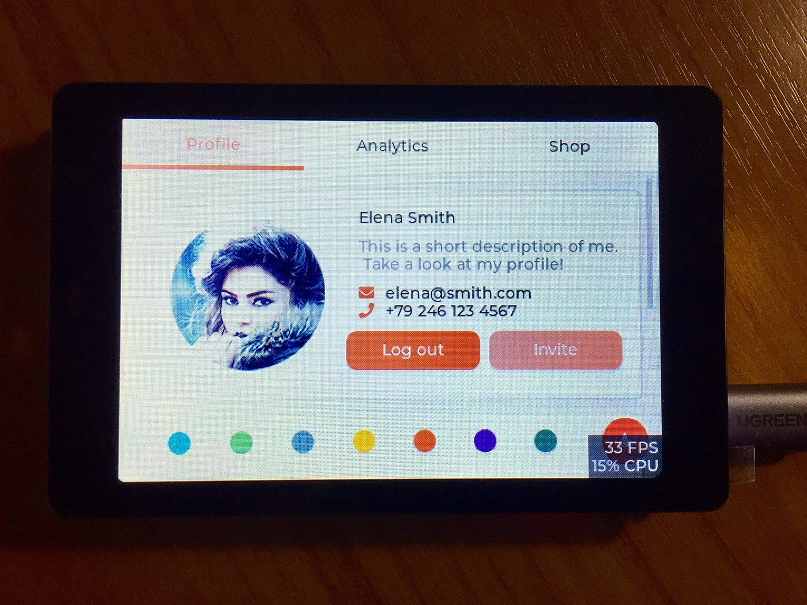

# LVGL project for wireless-tag WT\_32\_SC01

This is an [WT\_32\_SC01] (https://item.taobao.com/item.htm?spm=a2oq0.12575281.0.0.15d11debmmCZdd&ft=t&id=611104447515) from [wireless-tag](http://www.wireless-tag.cn) demo project showcasing LVGL v7 with support for several display controllers(ST7796S) and touch controllers(FT6336U).



Supported display controllers:

## TFT

- ILI9341
- ILI9488
- ILI9486
- HX8357B/HX8357D
- ST7789
- ST7735S
- ST7796S

## Monochrome

- SH1107
- SSD1306

## e-Paper

- IL3820

Supported touchscreen controllers:

- XPT2046
- FT3236
- other FT6X36 or the FT6206 controllers should work as well (not tested)
- STMPE610

If your display controller is not supported consider contributing to this repo by
adding support to it! [Contribute controller support](CONTRIBUTE_CONTROLLER_SUPPORT.md)

## Get started
### Install the ESP32 SDK
http://esp-idf.readthedocs.io/en/latest/

Note:

This project tries to be compatible with the ESP-IDF v4.0.
Instructions here are given for the v4.x toolchain using `idf.py`, but it is easy to translate to make.
For example instead of running `idf.py menuconfig`, just run `make menuconfig`.

### Build this repository standalone and run the demo.

Try this first to make sure your hardware is supported, wired and configured properly.

1. Get this project: `git clone --recurse-submodules
https://github.com/wireless-tag-cn/lv_port_esp32.git`

2. From its root run `idf.py menuconfig`

3. Select your display kit or board and other options - see [config options](#configuration-options)

4. For monochrome displays we suggest enabling the `unscii 8` font (Component config -> LVGL configuration -> FONT USAGE) and the MONO theme (Component config -> LVGL configuration -> THEME USAGE).

5. Store your project configuration.

6. For monochrome displays edit the `lv_conf.h` file available on the `components/lvgl` directory to look like follows:

```
#define LV_THEME_DEFAULT_INIT               lv_theme_mono_init
#define LV_THEME_DEFAULT_COLOR_PRIMARY      LV_COLOR_BLACK
#define LV_THEME_DEFAULT_COLOR_SECONDARY    LV_COLOR_WHITE
#define LV_THEME_DEFAULT_FLAG               0
#define LV_THEME_DEFAULT_FONT_SMALL         &lv_font_unscii_8
#define LV_THEME_DEFAULT_FONT_NORMAL        &lv_font_unscii_8
#define LV_THEME_DEFAULT_FONT_SUBTITLE      &lv_font_unscii_8
#define LV_THEME_DEFAULT_FONT_TITLE         &lv_font_unscii_8
```

7. `idf.py build`

8. `idf.py -p (YOUR PORT) flash`
